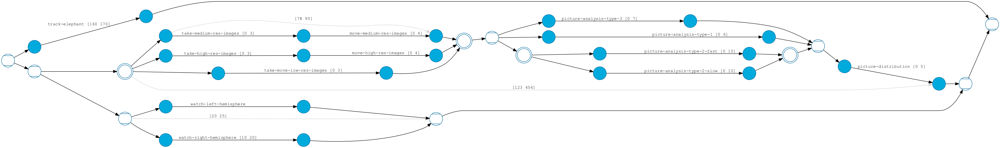

# PAMELA

Probabalistic Advanced Modeling and Execution Learning Architecture (PAMELA).

The goal of PAMELA is to design and implement a new probabilistic
modeling language that extends the current state of the art process modeling
languages, such as RMPL by adding first class probability
variables. The compiler will not only compile the model into an
automata representation such as a "Probabilistic Hierarchical
Constraint Automata" (PHCA), but it will also synthesize a learning
algorithm to bind the probabilistic variables using machine learning
algorithms, appropriate for the program. This approach reduces the
need for the programmer to be an expert in machine learning algorithms
freeing the programmer to write models that employ probability values.

One of our initial focuses has been on developing language constructs to support Temporal
Planning Network (TPN) for consumption by a suitable TPN execution engine.

## TPN Example

Consider a simple mission to be performed by a quadcopter equipped with video cameras and
some processing power. The quadcopter's mission is to monitor, process and upload images
of the recently discovered white elephant in a land far far away.  Reconnaissance drones
have already sent the location of the elephant.  The purpose of this mission is to
collect photos of the elephant from high above the ground so as to not interfere with the
natural habitat of the elephant.

Our quadcopter(QC) is an autonomous QC that can plan and adapt its own actions to ensure
that mission is successful. For example, it could choose to the take images at full resolution or
high resolution, perform image analysis at high speed or low speed to conserve power. In
addition to video sensors, our QC is also equipped with two additional sensors for self defensive
maneuvering actions from other wild birds who mistake QC for prey.

This mission is described in ./src/test/pamela/tpn-demo.pamela

Example command line to visualize this TPN is below. Before trying out the command line, please ensure requirements outlined below are met.

`./bin/pamela -v -v -i src/test/pamela/tpn-demo.pamela -o tpn-demo -f dot --visualize tpn
`

Now open tpn-demo.svg in your browser. It should appear as the following image

## Requirements

PAMELA has been developed using the [Clojure](http://clojure.org)
language which runs on the Java Virtual Machine.

Running PAMELA requires the following to be installed

* [JDK](http://www.oracle.com/technetwork/java/javase/downloads/index.html) 7 (or later)
* [Leiningen](http://leiningen.org/)

## Development status and Contributing

_NOTE: during the pre-release period contributions will not be accepted_

PAMELA is currently under heavy development and has not been tagged an
official "release". In this *pre-release* status the PAMELA API and
functionality is subject to change. All early users are encouraged to
file issues for any bugs or missing functionality they encounter.

Currently there is no mailing list setup for PAMELA (but will be
at some point soon)!

PAMELA is licensed under the [Apache License 2.0](LICENSE). By making
contributions to PAMELA via issues, pull requests, mailing list patches, etc.
you are agreeing such contributions are made under the same
[Apache License 2.0](LICENSE).

## Further Documentation

* Detailed notes on generating [TPNs](TPN.md)
* PAMELA API docs:  _TBD_
* Command line **pamela** (see pamela in `src/main/clj/pamela/cli.clj`)
* Jenkins:
    * _Soon to be transitioned to a public Jenkins server_
* Elasticsearch
    * https://elastic.co/
    * https://www.elastic.co/guide/index.html
    * https://github.com/clojurewerkz/elastisch
    * http://clojureelasticsearch.info/articles/getting_started.html
    * http://reference.clojureelasticsearch.info/index.html

## Startup time

In order to speed up execution you can compile the PAMELA uberjar with `lein prod` or use the **pamelad** daemon as described in [TPN's](TPN.md)

## Copyright and license

Copyright © 2016 Dynamic Object Language Labs Inc.

Licensed under the [Apache License 2.0](http://opensource.org/licenses/http://opensource.org/licenses/Apache-2.0) [LICENSE](LICENSE)

#Acknowledgement and Disclaimer
This material is based upon work supported by the Army Contracting and DARPA under contract No. W911NF-15-C-0005.
Any opinions, findings and conclusions or recommendations expressed in this material are those of the author(s) and do
not necessarily reflect the views of the Army Contracting Command and DARPA.
