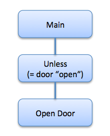
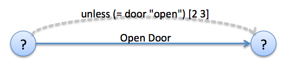

# Representation of Conditionals in Pamela

## 4 structurally equivalent Pamela statement types
Pamela provides a family of 4 different condition statements:

* `unless`
* `when`
* `whenever`
* `maintain`

Each is roughly analogous in structure, in that each consists of a ***condition*** along with a ***body***.  The difference between the 4 different statement types lies in when and how the condition is evaluated.  Depending on the condition value, the body will be evaluated (possibly multiple times).  For complete details of the semantics of each statement type, refer to the [Pamela Language Manual](Pamela.md)  

## HTN Representation

In the HTN representation, the condition is inserted as another HTN expanded method (HEM).

To illustrate, consider the following example:

```
(defpclass main []
  :methods
  [(defpmethod main []
     (unless (= door "open") :bounds [2 3]
             (open-door)))
   (defpmethod open-door [])))
```

When viewed in PlanViz, this TPN fragment would look something like:



## TPN Representation
The structural TPN representation of a conditional statement is analogous to a `parallel` statement in that it includes a `*-begin` node, a single activity (which may be a block of activities, such as a sequence), and ends in a `*-end` node.  In addition, the `*-begin` node has a `condition` attribute, which is similar to a constraint (but different). 

The `unless` statement from above will result in the following TPN elements:

```
"node-1":
{"activities":["act-2"],
  "condition": {"type":"equal",
                "args":[{"type":"state-variable", "name":"door"}, "open"]}
  "constraints":["tc-12"],
  "end-node":"node-3",
  "htn-node":"hem-33",
  "incidence-set":[],
  "tpn-type":"unless-begin",
  "uid":"node-1"},
 
 "act-2":
 {"args":[],
  "argsmap":{},
  "command":"open-door",
  "constraints":[],
  "controllable":false,
  "cost":0,
  "display-args":[],
  "display-name":"Open Door",
  "end-node":"node-3",
  "htn-node":"hem-36",
  "name":"Open Door",
  "reward":0,
  "tpn-type":"activity",
  "uid":"act-2"},
  
 "node-3":
 {"activities":[],
  "constraints":[],
  "htn-node":"hem-33",
  "incidence-set":["act-2"],
  "tpn-type":"unless-end",
  "uid":"node-3"},
  
 "tc-12":
 {"end-node":"node-3",
  "tpn-type":"temporal-constraint",
  "uid":"tc-12",
  "value":[2, 3]}, 
```

The complete set of begin and end node tpn-types are:

Start Node    | End Node
------------- | -------------
unless-begin  | unless-end
when-begin    | when-end
whenever-begin  | whenever-end
maintain-begin  | maintain-end

From the perspective of the TPN Dispatcher, all of the `*-begin` nodes are treated in a similar manner.  However, the Dispatcher does need to recognize the statement type, since the statement type is needed by the Pamela Belief State Manager (BSM).

The `condition` is a map structure.  Although it has the same form as a condition within the Pamela Intermediate Representation (IR), some of the symbolic references have been dereferenced during the construction of the HTN and TPN.


It may or may not be useful to introduce initial and terminal null activities for the conditional's activity. 

When viewed in PlanViz, this TPN fragment would look something like:



Note that the condition-type (`unless`) and the actual condition `(= door "open")` are displayed along with any applicable temporal constraints.  
  
  